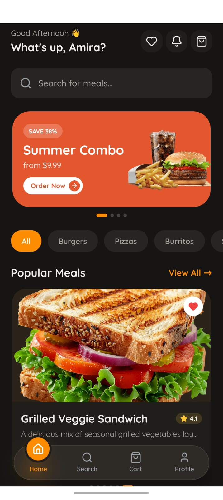
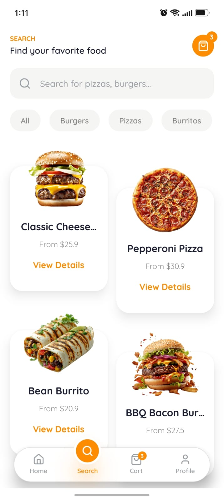
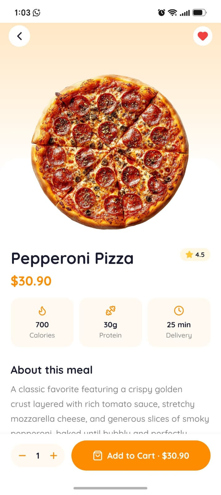
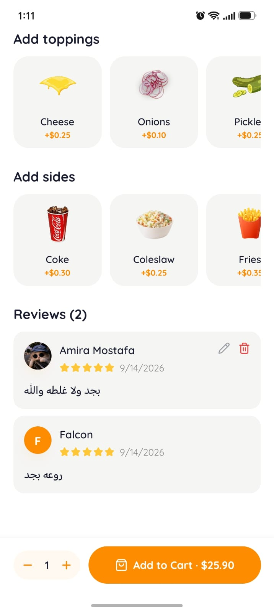
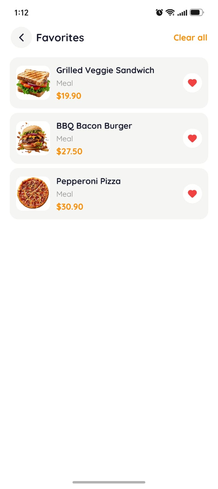
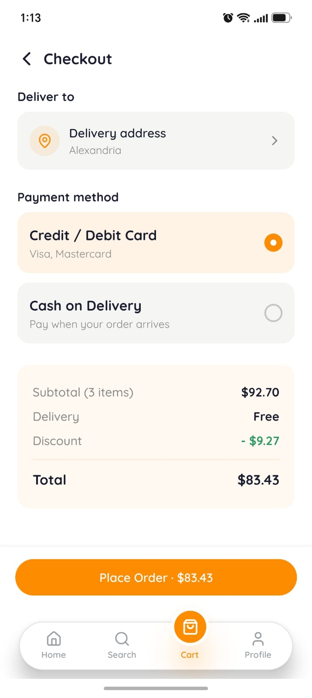
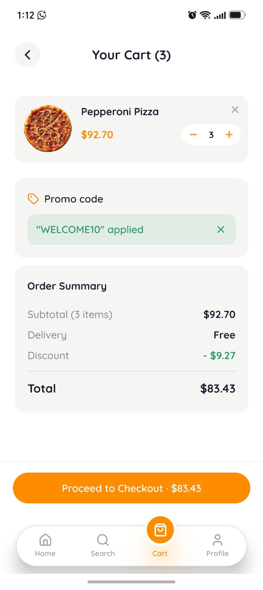
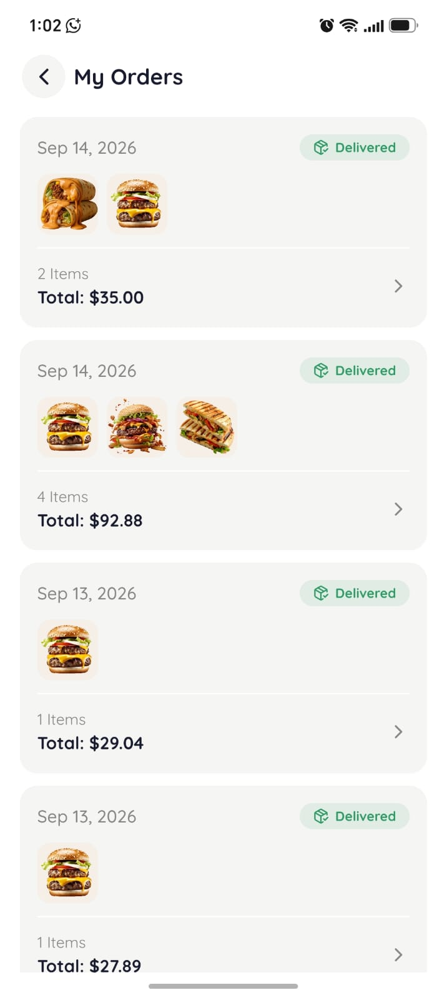
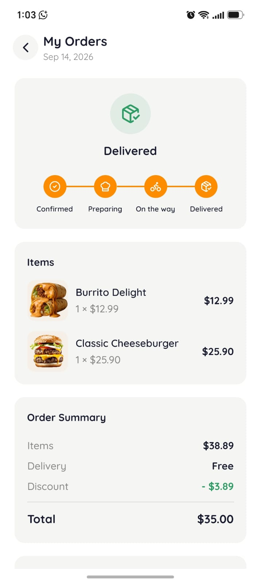
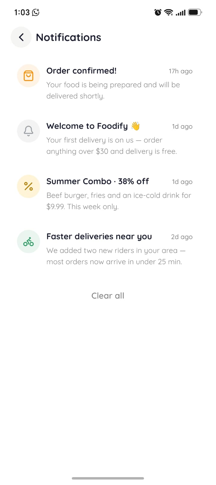

# 🍔 Foodify

A cross‑platform food‑ordering app built with **Expo (React Native)**, **Expo Router**, **NativeWind**, **Zustand**, and **Appwrite**, with **Stripe** for card payments.

Browse a menu, customise items with toppings and sides, manage a cart, check out with a real Stripe payment sheet or cash on delivery, leave star ratings/reviews, save favorites, and track orders — in Arabic or English, light or dark.

> ⚠️ This is a portfolio project. It talks to an Appwrite Cloud (or self‑hosted) backend that you provision yourself (see **Backend setup** below).

---

## 📱 Screenshots

<table>
  <tr>
    <td align="center"><br><sub>Onboarding</sub></td>
    <td align="center"><br><sub>Sign in</sub></td>
    <td align="center"><br><sub>Home</sub></td>
    <td align="center"><br><sub>Home — dark mode</sub></td>
  </tr>
  <tr>
    <td align="center"><br><sub>Search</sub></td>
    <td align="center"><br><sub>Item details</sub></td>
    <td align="center"><br><sub>Toppings & reviews</sub></td>
    <td align="center"><br><sub>Favorites</sub></td>
  </tr>
  <tr>
    <td align="center"><br><sub>Checkout</sub></td>
    <td align="center"><br><sub>Card payment (demo)</sub></td>
    <td align="center"><br><sub>Order history</sub></td>
    <td align="center"><br><sub>Order tracking</sub></td>
  </tr>
  <tr>
    <td align="center"><br><sub>Notifications</sub></td>
    <td align="center"><br><sub>Profile</sub></td>
    <td align="center" colspan="2"><br><sub>Settings — Arabic (RTL)</sub></td>
  </tr>
</table>

More screenshots (light/dark variants, English settings, cart empty state) are in [`docs/screenshots/extra`](docs/screenshots/extra).

---

## ✨ Features

| Area                  | What it does                                                                                          |
| ---------------------- | ------------------------------------------------------------------------------------------------------ |
| **Onboarding**         | 3‑slide intro, shown once (persisted in `AsyncStorage`)                                                |
| **Auth**               | Email/password sign‑up & sign‑in via Appwrite; forgot‑password by emailed 6‑digit code (no deep links) |
| **Menu & Search**      | Server‑side search + category filter, two‑column grid                                                 |
| **Item details**       | Calories/protein, selectable toppings & sides with live price                                          |
| **Reviews & ratings**  | One review per user per item, edit/delete your own; item's average rating stays in sync automatically |
| **Favorites**          | Save menu items and offers, per‑account on the device                                                  |
| **Offers**             | Promo bundles with autoplaying muted video, discount breakdown                                         |
| **Cart & checkout**    | Promo codes, delivery address required, Stripe Payment Sheet **or** cash on delivery                   |
| **Orders**             | Order history + a detail screen per order, scoped to the buyer only                                    |
| **Notifications**      | In‑app notification center; order/offer notifications deep‑link to the relevant screen                 |
| **Profile & settings** | Edit name/phone/photo/addresses, change password, language (AR/EN) and theme (light/dark) toggles      |

---

## 🧱 Tech stack

- **Expo SDK 57**, React Native 0.86, React 19, new architecture + React Compiler
- **Expo Router v6** — file‑based routing, typed routes
- **NativeWind v4** (Tailwind for RN) for styling
- **Zustand** (with `persist`) for auth, cart, favorites, notifications, theme and language state
- **Appwrite** (`react-native-appwrite`) — auth, database, storage, functions
- **Stripe** (`@stripe/stripe-react-native`) — Payment Sheet
- Custom lightweight **i18n** (`lib/i18n.ts`) — Arabic/English, no external library
- **TypeScript** (strict), ESLint (`eslint-config-expo`), Prettier

---

## 📂 Project structure

```
app/                       # Expo Router routes
  (onboarding)/            # first‑run intro
  (auth)/                  # sign‑in / sign‑up (+ shared layout)
  (tabs)/                  # Home, Search, Cart, Profile
  details/[id].tsx         # menu item details + reviews
  offer-details/[id].tsx
  order-details/[id].tsx
  orders.tsx                # order history
  favorites.tsx
  notifications.tsx
  settings.tsx
  edit-profile.tsx
components/                 # reusable UI (Button, Input, Cards, Modals…)
constants/                  # image map, offers data, promo codes, onboarding slides
lib/                        # appwrite client, i18n, data hooks, payment service, seed
store/                      # zustand stores (auth, cart, favorites, notifications, theme, language)
type.d.ts                   # shared types
appwrite/functions/         # source for the check-email Appwrite Function
```

---

## 🚀 Getting started

### 1. Prerequisites

- Node 18+
- An [Appwrite](https://appwrite.io) project (Cloud or self‑hosted)
- A [Stripe](https://stripe.com) account (test mode is fine)
- For real card payments you need a **development/preview build** (Stripe's
  native module does not run in Expo Go). Everything else works in Expo Go.

### 2. Install

```bash
npm install
```

### 3. Environment variables

```bash
cp .env.example .env
```

Then fill in `.env`. Every value and where to find it is documented inside
`.env.example`. Nothing secret goes in this file — the Stripe **secret** key
lives only in the Appwrite function (step 5), and every `EXPO_PUBLIC_*`
variable here is a public client identifier (project/database/bucket ID,
Stripe **publishable** key), never a secret.

### 4. Backend setup (Appwrite)

Create one **Database** and the following **collections** (IDs must match
`lib/appwrite.ts`):

| Collection ID         | Attributes                                                                                                                                              |
| ---------------------- | ---------------------------------------------------------------------------------------------------------------------------------------------------------------- |
| `user`                 | `name`, `email`, `avatar`, `accountId`, `phone?`, `address_home?`, `address_work?`                                                                                 |
| `categories`           | `name`, `description`                                                                                                                                              |
| `menu`                 | `name`, `description`, `image_url`, `price` (float), `rating` (float), `calories` (int), `protein` (int), `categories` (relation → `categories`)                  |
| `customizations`       | `name`, `price` (float), `type` (enum: `topping`, `side`)                                                                                                          |
| `menu_customizations`  | `menu` (relation → `menu`), `customization` (relation → `customizations`), `customization_name`, `customization_price` (float), `customization_type`              |
| `orders`               | `userId`, `items` (string, JSON), `totalAmount`, `deliveryFee`, `discount`, `finalAmount`, `paymentIntentId`, `paymentStatus`, `orderStatus`, `deliveryAddress?`, `customerName`, `customerEmail`, `customerPhone?` |
| `reviews`              | `menuItemId`, `userId`, `userName`, `userAvatar?`, `rating` (int/float), `comment?`                                                                                |

**Permissions** (Security tab per collection) — get this right, it's the
actual access-control boundary, not just what the app's UI happens to query:

- `user`, `orders`, `reviews`: turn **Document Security ON**. The app grants
  per-document permissions itself at creation time (read‑only‑by‑owner for
  `user`/`orders`; the review's author additionally gets update/delete on
  their own review). Don't also grant a blanket collection‑level
  read/update to `users` on these three — that would let any signed‑in
  account read or edit *everyone's* profile/orders/reviews via a direct API
  call, bypassing the app's own query filters (which are UI convenience,
  not security).
- `categories`, `customizations`, `menu`: read‑only for `any`/`users` at the
  collection level; no client create/update/delete (seeding uses a
  privileged API key, not the client SDK).
  - Exception: grant **Update** to `users` on `menu` too, if you want each
    item's `rating` to auto‑sync from real reviews (see `syncMenuItemRating`
    in `lib/appwrite.ts`). Trade‑off: this also lets any authenticated user
    update *any* field on *any* menu item via a direct API call, since
    Appwrite permissions aren't per‑field. Fine for a portfolio demo;
    for anything real, move that sync into a server‑side Appwrite Function
    (triggered on the `reviews` collection's database events) instead, and
    skip this grant entirely.
- `menu_customizations`: read‑only for `any`/`users`.

Also enable the **Email OTP** auth method under Auth → Settings (forgot‑password
uses `account.createEmailToken`, not the classic recovery‑link flow), create a
**Storage bucket**, and register an **Android/iOS platform** whose bundle id
matches `app.json` (`com.foodify.app`).

**Seed sample data:** temporarily call the seeder once — in `app/_layout.tsx`
add `import seed from "@/lib/seed";` and run `seed()` inside a `useEffect`, open
the app once, then remove it. Menu data lives in `lib/data.ts`.

### 5. Stripe payment function (Appwrite Functions)

Payments never expose the Stripe secret to the client. Create an Appwrite
Function (Node) that:

1. reads `{ amount, currency, customerEmail, customerName }` from the request body,
2. creates a Stripe `PaymentIntent` with your **secret** key (set as a function
   env var, e.g. `STRIPE_SECRET_KEY`),
3. returns `{ success: true, clientSecret, paymentIntentId }`.

Put its Function ID in `EXPO_PUBLIC_APPWRITE_FUNCTION_PAYMENT_ID`.

### 6. Check-email function (Appwrite Functions)

Forgot-password needs to know whether an email is actually registered
before emailing it a reset code — that check needs a privileged key, which
can't live in the app, so it's a second small function. Source, and full
deploy steps, are in `appwrite/functions/check-email/`.

Put its Function ID in `EXPO_PUBLIC_APPWRITE_FUNCTION_CHECK_EMAIL_ID`.
Optional, but without it configured the check is skipped and an unregistered
email would silently get a brand-new (passwordless) account created for it
by `account.createEmailToken` — deploy this function in any real environment.

### 7. Run

```bash
npm run start:go          # Expo Go — everything works except real card payments
```

Card payments (`@stripe/stripe-react-native`) need a **development or preview
build**, since Stripe's native module is not in Expo Go:

```bash
# set EXPO_PUBLIC_ENABLE_STRIPE=true in .env, re-add the
# "@stripe/stripe-react-native" config plugin to app.json, then:
npx expo run:android      # or: eas build --profile development
```

With `EXPO_PUBLIC_ENABLE_STRIPE` unset/false, Metro swaps Stripe for a stub
(`lib/stripe-stub.tsx`) and checkout falls back to cash on delivery (or a mock
card sheet).

### 8. Shareable build (EAS)

An `eas.json` with a `preview` profile is already in the repo — it produces
an installable Android APK (internal distribution, no Play Store involved):

```bash
npx eas-cli build --platform android --profile preview
```

---

## 📜 Scripts

| Script                    | Purpose                              |
| ------------------------- | ------------------------------------- |
| `npm run start:go`        | Expo dev server, forced Expo Go mode |
| `npm start`                | Expo dev server (dev-client mode)     |
| `npm run android` / `ios` | build & run a native dev client       |
| `npm run lint`             | ESLint                                |
| `npm run typecheck`        | `tsc --noEmit`                        |
| `npm run format`           | Prettier write                        |

---

## 🗺️ Roadmap

- [ ] Pull‑to‑refresh & skeleton loaders on more screens
- [ ] Unit tests for the stores, component tests with RNTL
- [ ] Accessibility pass (labels / roles)
- [ ] Move menu-rating aggregation into a server‑side Appwrite Function
      instead of a client‑grantable `menu` Update permission
